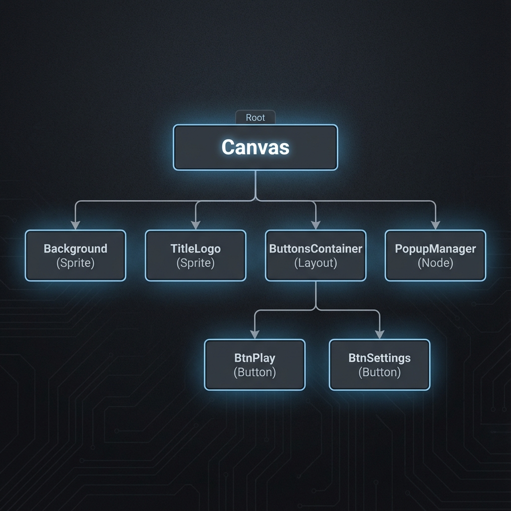
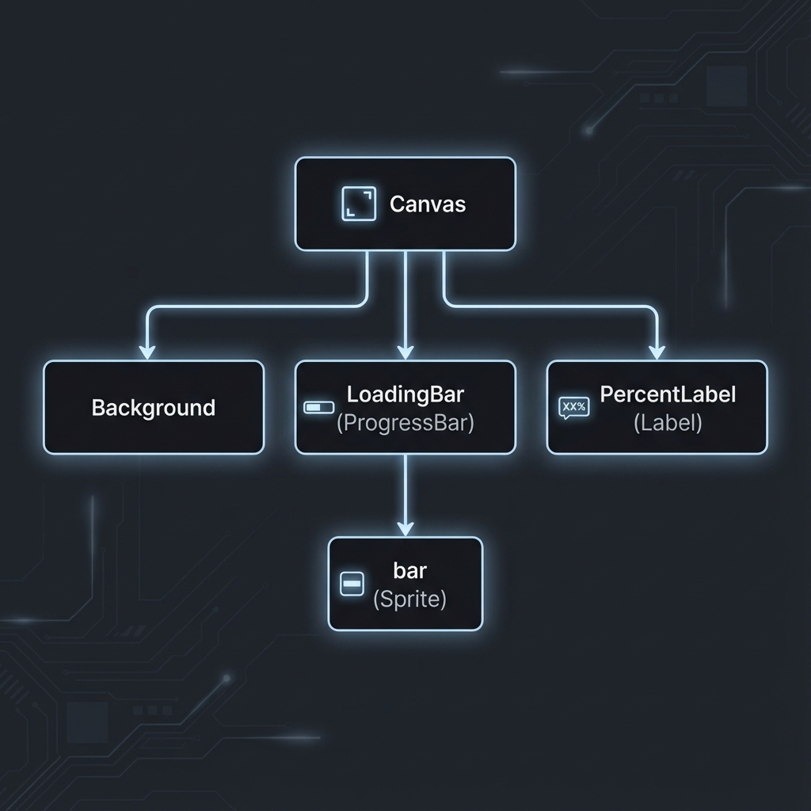
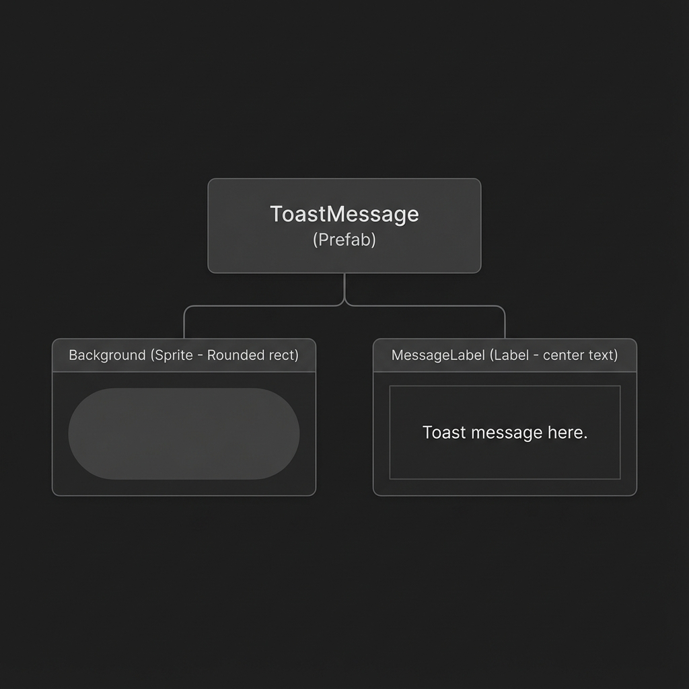
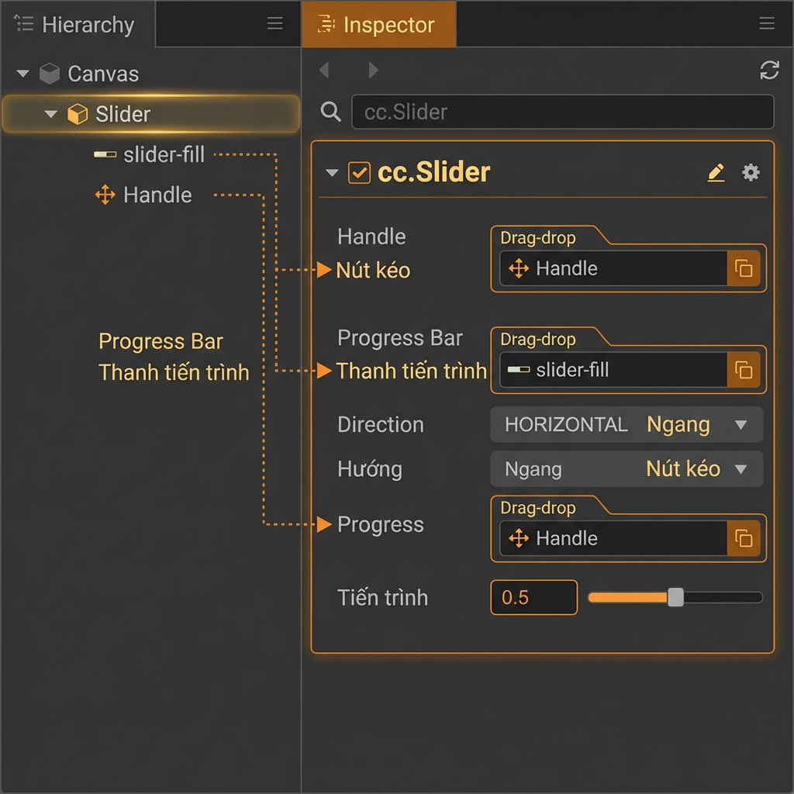
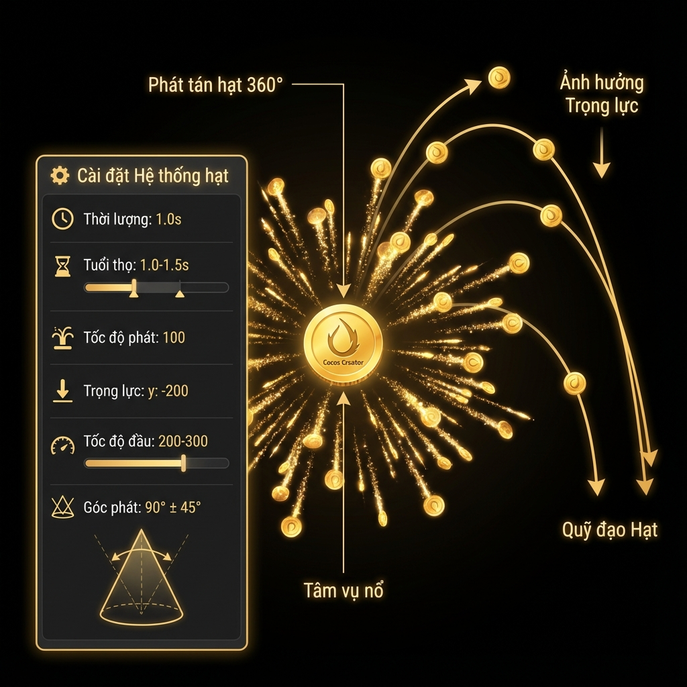

# Hướng Dẫn Part 2 & Part 3: All-in-One (Phiên Bản V16 - Full Part 2 + Part 3)

Đây là tài liệu hướng dẫn **TRỌN VẸN 100%** bao gồm **Part 2** (8 modules UI/UX) và **Part 3** (5 modules Audio/Particles/Juice). Từ Popup System, Settings, Scrim, Slider đến AudioManager, Win Rollup, Particles và Auto-Spin.

---

## 🛠 MODULE 1: Popup System (Core UI)

Mục tiêu: Tạo hệ thống quản lý popup "Mẹ", chuyên quản lý các popup "Con" và chặn click xuyên thấu.

### Bước 1: Code Core (Setup Script)

**1. File `assets/scripts/ui/PopupBase.ts`**:
```typescript
import { _decorator, Component, Node, Prefab, tween, Vec3 } from 'cc';
const { ccclass, property } = _decorator;

@ccclass('PopupBase')
export class PopupBase extends Component {
    @property(Node) container: Node = null!;
    
    show() {
        this.node.active = true;
        this.container.setScale(Vec3.ZERO);
        tween(this.container).to(0.3, { scale: Vec3.ONE }, { easing: 'backOut' }).start();
    }
    
    hide() {
        tween(this.container).to(0.2, { scale: Vec3.ZERO }, { easing: 'backIn' })
            .call(() => { this.node.active = false; }).start();
    }
    
    onCloseClicked() { this.hide(); }
}
```

**2. File `assets/scripts/ui/PopupManager.ts`**:
```typescript
import { _decorator, Component, Node, Prefab, instantiate, director } from 'cc';
import { PopupBase } from './PopupBase';
const { ccclass, property } = _decorator;

@ccclass('PopupManager')
export class PopupManager extends Component {
    private static _instance: PopupManager = null;
    public static get instance() { return this._instance; }

    @property(Node) popupContainer: Node = null!;
    @property(Node) scrimNode: Node = null!;

    onLoad() {
        if (!PopupManager._instance) {
            PopupManager._instance = this;
            director.addPersistRootNode(this.node);
        } else { this.destroy(); }
    }

    show(prefab: Prefab): void {
        const node = instantiate(prefab);
        this.popupContainer.addChild(node);
        const popup = node.getComponent(PopupBase);
        this.scrimNode.active = true;
        popup.show();
    }

    hideAll() {
        this.popupContainer.destroyAllChildren();
        this.scrimNode.active = false;
    }
}
```

### Bước 2: Setup Editor (Hierarchy & Inspector)

**1. Cấu trúc Cây Thư Mục (Hierarchy)**

*   Tạo Node `PopupManager`. Add script `PopupManager`.
*   Tạo Node con `Scrim` (Sprite đen, Opacity 150).
    *   Add Component `BlockInputEvents`.
    *   Add Component `Widget` (Top/Bottom/Left/Right = 0px).
*   Tạo Node con `PopupContainer` (Node rỗng).

**2. Gán Script (Inspector)**

*   Kéo `Scrim` và `PopupContainer` vào ô tương ứng trong script `PopupManager`.

---

## 🎨 MODULE 2.1: UI/UX Design & Hình Ảnh Minh Họa

Dưới đây là hình ảnh thực tế để bạn dễ hình dung về giao diện Settings Popup và cấu trúc Slider.

**1. Giao Diện Settings Popup Hoàn Chỉnh:**
Hãy tạo giao diện trong Editor giống như hình này. Nền tối, chữ Vàng, Nút đỏ.


**2. Cấu Trúc Thanh Trượt (Slider):**
Để làm Slider đẹp, bạn cần tách lớp (Layer) như sơ đồ kỹ thuật dưới đây.
*   **Background**: Lớp dưới cùng (Màu xám).
*   **ProgressBar**: Lớp giữa (Màu xanh).
*   **Handle**: Cục nắm tròn ở trên cùng.


---

## ⚙️ MODULE 2: Hướng Dẫn Kéo Thả Tạo Prefab (Settings Popup)

**Mục tiêu**: Làm theo sơ đồ trên để tạo Prefab.

### Bước 1: Tạo Bộ Khung Node (Trong Scene)
Làm trực tiếp trên **Hierarchy**:

1.  **Tạo Nút Gốc (Root)**:
    *   Chuột phải vào `Canvas` -> Create Empty Node.
    *   Đổi tên thành `SettingsPopup`.
    *   Add Script `SettingsPopup` (hoặc `PopupBase`).

2.  **Tạo Container & Nội Dung**:
    *   Trong `SettingsPopup`, tạo con `Container`. Add `BlockInputEvents`.
    *   Trong `Container`, tạo con `Background` (Sprite Sliced).
    *   Trong `Container`, tạo con `TitleLabel` (Label + Outline + Shadow).
    *   Trong `Container`, tạo con `CloseButton` (Button).
    *   Trong `Container`, tạo con `VolumeSlider` (Slider). 
        *   **Lưu ý**: Chỉnh sửa Slider con (Handle, Background, ProgressBar) giống hệt hình ảnh Module 2.1 ở trên.

### Bước 2: Liên Kết Script (Kéo Thả)
1.  Chọn `SettingsPopup` (Root).
2.  Kéo `Container` vào ô Container.
3.  Kéo `VolumeSlider` UI vào ô Volume Slider.

### Bước 3: Đóng Gói
1.  Kéo `SettingsPopup` xuống Assets -> Prefab.
2.  Xóa trên Scene.

---

## 🎮 MODULE 2.5: Code Logic Chi Tiết Cho Từng Popup

**1. Settings Popup (File: `SettingsPopup.ts`)**
```typescript
import { _decorator, Slider, sys } from 'cc';
import { PopupBase } from './PopupBase';
const { ccclass, property } = _decorator;

@ccclass('SettingsPopup')
export class SettingsPopup extends PopupBase {
    @property(Slider) volumeSlider: Slider = null!;

    start() {
        const savedVol = sys.localStorage.getItem('volume');
        if (savedVol) {
            this.volumeSlider.progress = parseFloat(savedVol);
        }
    }

    // Gán hàm này vào Event 'Slide' của Slider trong Editor
    onSliderChanged(slider: Slider) {
        sys.localStorage.setItem('volume', slider.progress.toString());
        // AudioManager.instance.setVolume(slider.progress);
    }
}
```

**2. Pause Popup (File: `PausePopup.ts`)**
```typescript
import { _decorator, director } from 'cc';
import { PopupBase } from './PopupBase';
import { GameManager } from '../game/GameManager';
const { ccclass } = _decorator;

@ccclass('PausePopup')
export class PausePopup extends PopupBase {
    onEnable() {
        GameManager.isPaused = true;
    }

    onResumeClicked() { // Gán vào nút Resume
        GameManager.isPaused = false;
        this.hide();
    }
    
    onQuitClicked() { // Gán vào nút Quit
        GameManager.isPaused = false;
        director.loadScene("LobbyScene");
    }
}
```

---

## 🏠 MODULE 3: Lobby & Scenes

Setup Lobby Scene như hình:


Code `Assets/scripts/scenes/LobbyManager.ts`:
```typescript
import { _decorator, Component, Prefab, director } from 'cc';
import { PopupManager } from '../ui/PopupManager';
const { ccclass, property } = _decorator;

@ccclass('LobbyManager')
export class LobbyManager extends Component {
    @property(Prefab) settingsPrefab: Prefab = null!; 
    
    onPlayClicked() {
        director.loadScene('LoadingScene');
    }
    
    onSettingsClicked() {
        PopupManager.instance.show(this.settingsPrefab);
    }
}
```

---

## ⏳ MODULE 4: Loading Screen

Setup Loading Scene như hình:


Code `Assets/scripts/scenes/LoadingManager.ts`:
```typescript
import { _decorator, Component, director, ProgressBar, Label } from 'cc';
const { ccclass, property } = _decorator;

@ccclass('LoadingManager')
export class LoadingManager extends Component {
    @property(ProgressBar) bar: ProgressBar = null!;
    @property(Label) lbl: Label = null!;

    start() {
        director.preloadScene('GameScene', (completed, total) => {
            const p = completed / total;
            this.bar.progress = p;
            this.lbl.string = Math.floor(p * 100) + '%';
        }, () => {
            director.loadScene('GameScene');
        });
    }
}
```

---

## 🍞 MODULE 5: Toast & Juice

Setup Toast Prefab:


Code `Assets/scripts/ui/ToastManager.ts`:
```typescript
import { _decorator, Component, Node, Label, Prefab, instantiate, tween, Vec3 } from 'cc';
const { ccclass, property } = _decorator;

@ccclass('ToastManager')
export class ToastManager extends Component {
    public static instance: ToastManager;
    @property(Prefab) toastPrefab: Prefab = null!;
    @property(Node) container: Node = null!;

    onLoad() { ToastManager.instance = this; }

    show(msg: string) {
        const node = instantiate(this.toastPrefab);
        node.getComponentInChildren(Label).string = msg;
        this.container.addChild(node);
        node.setScale(Vec3.ZERO);
        
        tween(node).to(0.2, { scale: Vec3.ONE }, { easing: 'backOut' })
            .delay(1.5)
            .by(0.3, { position: new Vec3(0, 50, 0) }) 
            .call(() => node.destroy())
            .start();
    }
}
```

Code `Assets/scripts/ui/ButtonScale.ts` (Juice):
```typescript
import { _decorator, Component, Node, tween, Vec3 } from 'cc';
const { ccclass } = _decorator;

@ccclass('ButtonScale')
export class ButtonScale extends Component {
    start() {
        this.node.on(Node.EventType.TOUCH_START, () => {
            tween(this.node).to(0.1, { scale: new Vec3(0.9, 0.9, 1) }).start();
        });
        this.node.on(Node.EventType.TOUCH_END, () => {
            tween(this.node).to(0.1, { scale: Vec3.ONE }).start();
        });
    }
}
```

---

## 📜 MODULE 6: Paytable (ScrollView)

Setup ScrollView Structure chính xác như hình:


1.  Tạo **ScrollView**.
2.  Add component **Layout** vào Node `content`.
    *   Type: VERTICAL.
    *   Resize Mode: CONTAINER.
3.  Thêm các text/ảnh con vào `content`.

---

## 🎭 MODULE 7: Scrim (Nền Mờ Popup) - Troubleshooting

### Scrim Là Gì?

**Scrim** là lớp nền đen mờ xuất hiện phía sau popup, có 3 mục đích:
1. **Làm nổi bật popup** (tạo focus)
2. **Chặn click xuyên thấu** xuống UI bên dưới
3. **Tạo chiều sâu UI** (depth)

### Setup Scrim Trong PopupManager

**Cấu trúc:**
```
PopupManager
├── Scrim (Sprite + Widget + BlockInputEvents)
└── PopupContainer
```

**Bước 1: Tạo Node Scrim**
1. Chuột phải `PopupManager` → Create → **UI Component** → **Sprite**
2. Đổi tên thành `Scrim`
3. **Kéo Scrim lên trên PopupContainer** trong danh sách

**Bước 2: Cấu Hình Sprite**
1. **Sprite Frame**: Chọn `default_sprite` (trong `internal/default_ui/`)
2. **Type**: `SIMPLE`
3. **Color**: `#000000` (đen)
4. **Opacity**: `150` (60% trong suốt)

**Bước 3: Add Widget (Auto Resize)**
1. Add Component → `Widget`
2. Tick ✅ cả 4 cạnh:
   - Left = `0`, Right = `0`
   - Top = `0`, Bottom = `0`
3. Align Mode: `ALWAYS` hoặc `ON_WINDOW_RESIZE`

**Bước 4: Add BlockInputEvents**
1. Add Component → `BlockInputEvents`

**Bước 5: Gán Vào PopupManager**
1. Chọn `PopupManager` (node cha)
2. Kéo `Scrim` vào property `Scrim Node`
3. **Bỏ tick Active** cho Scrim (để ẩn ban đầu)

### Debug: Scrim Không Hiển Thị?

**Test nhanh:**
- Đổi Color thành `#FF0000` (đỏ)
- Opacity = `255`
- Chạy game → Nếu thấy màu đỏ = Scrim hoạt động

**Checklist:**
- [ ] Scrim có Sprite Component với SpriteFrame
- [ ] Widget đã tick cả 4 cạnh (Left/Right/Top/Bottom)
- [ ] BlockInputEvents đã add
- [ ] Scrim ở **trên** PopupContainer trong Hierarchy
- [ ] Property `scrimNode` đã gán trong PopupManager script

---

## 🎚️ MODULE 8: Slider Setup (Thanh Trượt)

### Hiểu Cấu Trúc Slider

Slider gồm 3 phần chồng lên nhau:


- **Layer 1**: Background (thanh nền xám)
- **Layer 2**: ProgressBar (thanh màu, thay đổi độ dài)
- **Layer 3**: Handle (cục tròn để kéo)

### Bước Setup Slider

#### **Bước 1: Sắp Xếp Hierarchy**


1. Tạo node cha `VolumeSlider` (Empty Node)
2. Kéo 3 node vào làm con:
   - `bg-slider` (Background)
   - `slider-fill` (ProgressBar)
   - `Handle` (cục tròn)

**Cấu trúc:**
```
VolumeSlider
├── bg-slider
├── slider-fill
└── Handle
```

#### **Bước 2: Add Component cc.Slider**

1. Chọn `VolumeSlider`
2. Add Component → `Slider`

#### **Bước 3: Cấu Hình cc.Slider**



1. **Handle**: Kéo node `Handle` vào
2. **Progress Bar**: Kéo node `slider-fill` vào
3. **Direction**: Chọn `HORIZONTAL`
4. **Progress**: Đặt `0.5`

#### **Bước 4: Đặt Position = (0,0,0)**

Tất cả node con phải có Position = `X:0, Y:0, Z:0`:
- bg-slider → Position (0, 0, 0)
- slider-fill → Position (0, 0, 0)
- Handle → Position (0, 0, 0)

#### **Bước 5: Cấu Hình Anchor Point**

**Chọn `slider-fill`** → UITransform:
- **Anchor Point**: `X = 0`, `Y = 0.5`
- (Giúp thanh mở rộng từ trái sang phải)

#### **Bước 6: Gán Vào SettingsPopup**

1. Chọn `SettingsPopup` (node gốc)
2. Component `SettingsPopup` (Script)
3. Property `Volume Slider` → Kéo node `VolumeSlider` vào

#### **Bước 7: Gán Event Cho Slider**

Để Slider gọi hàm khi kéo:

1. **Chọn node `VolumeSlider`**
2. **Inspector** → **cc.Slider** → Scroll xuống **Slide Events**
3. Click **+** để thêm event mới
4. **Kéo node `SettingsPopup`** (node gốc) vào ô target
5. **Component** → Chọn `SettingsPopup`
6. **Method** → Chọn `onSliderChanged`

**Giải thích:**
- Khi kéo slider → Gọi `SettingsPopup.onSliderChanged()`
- Hàm này lưu giá trị vào `localStorage`
- Code đã có sẵn trong MODULE 2.5!

### Code Tham Khảo

Code này đã có trong **MODULE 2.5**, nhưng nhắc lại để tiện:

```typescript
// File: SettingsPopup.ts (đã tạo sẵn)
@property(Slider) volumeSlider: Slider = null!;

start() {
    // Đọc giá trị đã lưu
    const savedVol = sys.localStorage.getItem('volume');
    if (savedVol) {
        this.volumeSlider.progress = parseFloat(savedVol);
    }
}

// Hàm này được gọi khi kéo slider (đã gán event ở Bước 7)
onSliderChanged(slider: Slider) {
    sys.localStorage.setItem('volume', slider.progress.toString());
    console.log('Volume:', slider.progress); // 0.0 → 1.0
}
```

### Troubleshooting Slider

**Vấn đề: Slider không kéo được**
- Kiểm tra: Handle đã gán vào cc.Slider chưa?

**Vấn đề: ProgressBar không thay đổi**
- Kiểm tra: Progress Bar đã gán vào cc.Slider chưa?

**Vấn đề: ProgressBar giãn sai hướng**
- Kiểm tra: Anchor Point của slider-fill = (0, 0.5) chưa?

---

## ✅ Tổng Kết

Sau khi hoàn thành tất cả modules, bạn sẽ có:

✅ **Popup System** với animation mượt mà  
✅ **Scrim** chặn click và làm nổi bật popup  
✅ **Settings Popup** với Slider hoạt động  
✅ **Lobby Scene** với nút Settings  
✅ **Loading Screen** với progress bar  
✅ **Toast** và **Juice effects**  
✅ **ScrollView** cho Paytable  

**Lưu ý:** Nhớ **Save Scene** và **Save Prefab** sau mỗi thay đổi!


---

# ═══════════════════════════════════════════════════════════════
# PART 3: AUDIO, PARTICLES & "THE JUICE"
# ═══════════════════════════════════════════════════════════════

> **Mục tiêu:** Làm cho game GÂY NGHIỆN bằng âm thanh + hiệu ứng đẹp!

---

## 🎵 MODULE 9: AudioManager - Hệ Thống Âm Thanh

### Khái Niệm: 3 Audio Channels


Game slot cần **3 loại âm thanh chạy CÙNG LÚC**:
1. **BGM** (Background Music): Nhạc nền loop
2. **SFX** (Sound Effects): Click, reel stop, coin
3. **Voiceover**: "Big Win!", "Jackpot!"

### Code: AudioManager.ts

```typescript
import { _decorator, Component, AudioSource, AudioClip, sys } from 'cc';
const { ccclass, property } = _decorator;

@ccclass('AudioManager')
export class AudioManager extends Component {
    private static _instance: AudioManager;
    static get instance() { return this._instance; }
    
    @property(AudioSource) bgmSource: AudioSource = null!;
    @property(AudioSource) sfxSource: AudioSource = null!;
    @property(AudioSource) voiceSource: AudioSource = null!;
    
    @property(AudioClip) bgm_lobby: AudioClip = null!;
    @property(AudioClip) sfx_click: AudioClip = null!;
    @property(AudioClip) sfx_win: AudioClip = null!;
    
    onLoad() { AudioManager._instance = this; }
    
    playBGM(clip: AudioClip) {
        this.bgmSource.clip = clip;
        this.bgmSource.loop = true;
        this.bgmSource.play();
    }
    
    playSFX(clip: AudioClip) {
        this.sfxSource.playOneShot(clip);
    }
    
    setMusicVolume(vol: number) {
        this.bgmSource.volume = vol;
        sys.localStorage.setItem('music', vol.toString());
    }
}
```

### Setup Trong Editor

1. Tạo node `AudioManager` trong Scene
2. Add 3 component `AudioSource`
3. Gán vào properties: bgmSource, sfxSource, voiceSource
4. Kéo file `.mp3` vào AudioClip properties

---

## 💰 MODULE 10: Win Rollup - Số Tiền Tăng Dần


### Công Thức Lerp

```typescript
currentValue = currentValue + (targetValue - currentValue) * speed * dt
```

### Code: WinDisplay.ts

```typescript
export class WinDisplay extends Component {
    @property(Label) scoreLabel: Label = null!;
    
    private currentScore: number = 0;
    private targetScore: number = 0;
    private speed: number = 4.0;
    
    showWin(amount: number) {
        this.currentScore = 0;
        this.targetScore = amount;
    }
    
    update(dt: number) {
        if (this.currentScore < this.targetScore) {
            this.currentScore += (this.targetScore - this.currentScore) * this.speed * dt;
            this.scoreLabel.string = `$${Math.floor(this.currentScore)}`;
            
            if (Math.floor(this.currentScore) % 50 === 0) {
                AudioManager.instance.playSFX(this.sfx_tick);
            }
            
            if (this.targetScore - this.currentScore < 0.5) {
                this.currentScore = this.targetScore;
                this.scoreLabel.string = `$${this.targetScore}`;
            }
        }
    }
}
```

---

## ✨ MODULE 11: Particle System



### Setup Trong Editor

1. **Create** → **Effects** → **Particle System 2D**
2. **Configure:**

| Property | Value |
|----------|-------|
| Texture | coin.png |
| Duration | 1.0 |
| Life | 1.0 ~ 1.5 |
| Emission Rate | 100 |
| Gravity | (0, -200) |
| Start Speed | 200 ~ 300 |
| Angle | 90 ± 45 |

### Trigger Từ Code

```typescript
@property(ParticleSystem2D) coinParticle: ParticleSystem2D = null!;

onWin(winAmount: number) {
    this.coinParticle.node.setPosition(this.getWinSymbolPosition());
    this.coinParticle.resetSystem();
    
    this.scheduleOnce(() => {
        this.coinParticle.stopSystem();
    }, 1.5);
}
```

---

## 🔄 MODULE 12: Auto-Spin State Machine


### Code

```typescript
export class SlotMachine extends Component {
    private isAutoSpin: boolean = false;
    private autoSpinCount: number = 0;
    
    onSpinButtonPressed() {
        this.scheduleOnce(this.startAutoSpin, 1.0);
    }
    
    onSpinButtonReleased() {
        this.unschedule(this.startAutoSpin);
        if (!this.isAutoSpin) this.startSpin();
    }
    
    startAutoSpin() {
        this.isAutoSpin = true;
        this.autoSpinCount = 10;
        this.autoSpinLoop();
    }
    
    autoSpinLoop() {
        if (this.autoSpinCount > 0 && this.isAutoSpin) {
            this.startSpin();
            this.autoSpinCount--;
            this.scheduleOnce(this.autoSpinLoop, 2.0);
        } else {
            this.isAutoSpin = false;
        }
    }
    
    onScreenClicked() {
        if (this.isAutoSpin) {
            this.isAutoSpin = false;
            this.unscheduleAllCallbacks();
        }
    }
}
```

---

## 🎶 MODULE 13: Audio Dynamics (Advanced)


### Concept: Anticipation

Khi có 2 Scatter symbols → Tăng pitch BGM lên!

```typescript
checkForNearWin() {
    const scatterCount = this.countScatterSymbols();
    
    if (scatterCount === 2) {
        AudioManager.instance.setBGMPitch(1.1);
        AudioManager.instance.playSFX(this.sfx_tension);
        this.lastReel.spinSpeed *= 1.3;
    }
}

onAllReelsStopped() {
    AudioManager.instance.setBGMPitch(1.0);
}
```

---

## 📋 Part 3 Checklist

### **Must-Have:**
- [ ] AudioManager với BGM + SFX
- [ ] Win Rollup (lerp animation)
- [ ] Particle System (coin explosion)

### **Nice-to-Have:**
- [ ] Audio Dynamics (pitch tăng)
- [ ] Auto-Spin (hold button)
- [ ] Voiceover "Big Win!"

### **Advanced:**
- [ ] Spine animations
- [ ] Line connectors
- [ ] Multiple particle effects

---

## 🏆 Tổng Kết Toàn Bộ

Sau khi hoàn thành **Part 2 + Part 3**, bạn sẽ có:

✅ **PopupManager + Scrim** - UI system chuyên nghiệp  
✅ **Settings với Slider** - User preferences  
✅ **AudioManager** - Âm thanh phong phú  
✅ **Win Rollup** - Số tiền tăng dần  
✅ **Particles** - Hiệu ứng thị giác  
✅ **Auto-Spin** - Gameplay tiện lợi  

**Game giờ đã:** Nhìn đẹp, nghe hay, chơi nghiện! 🎰🎉

**Lưu ý:** Nhớ **Save Scene** và **Save Prefab** sau mỗi thay đổi!
