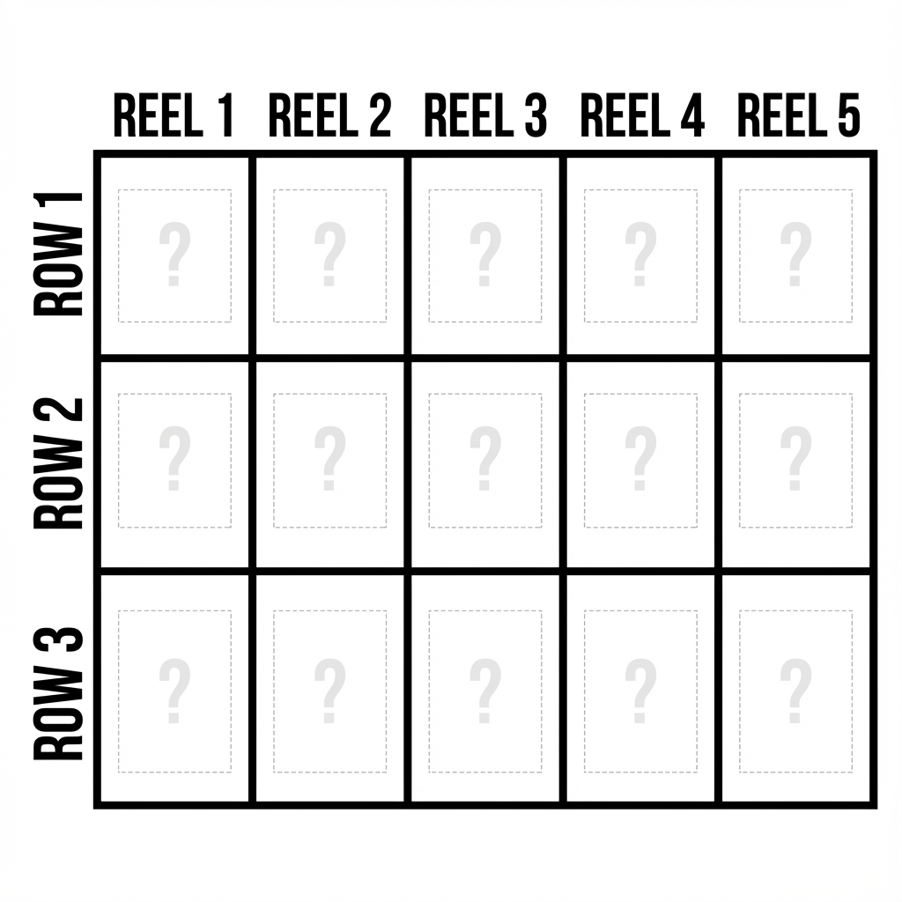
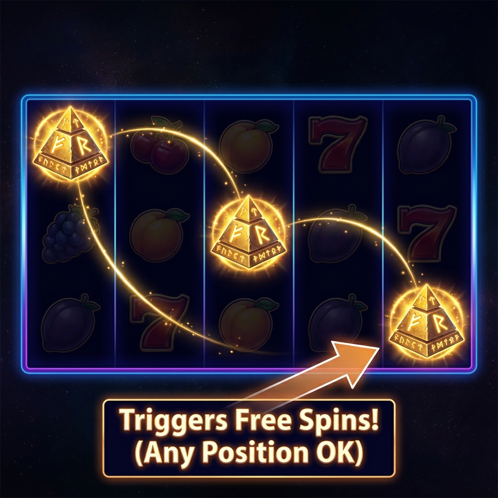
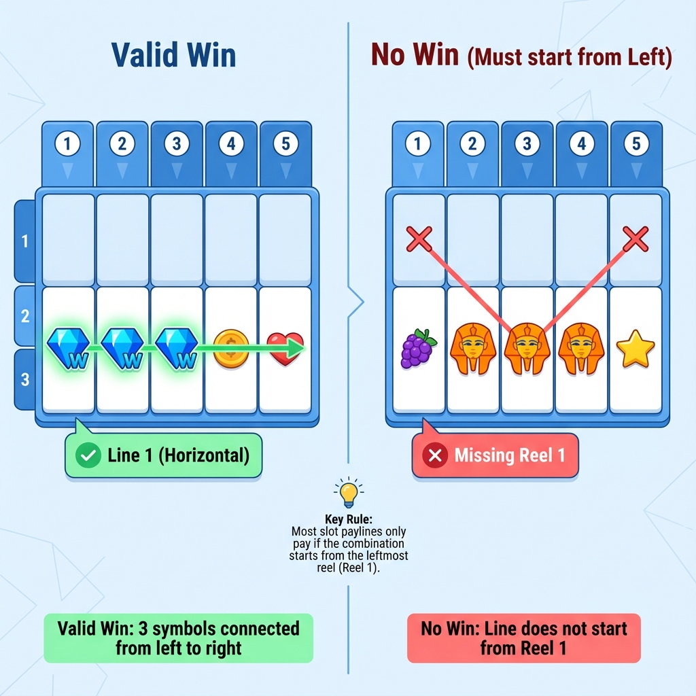
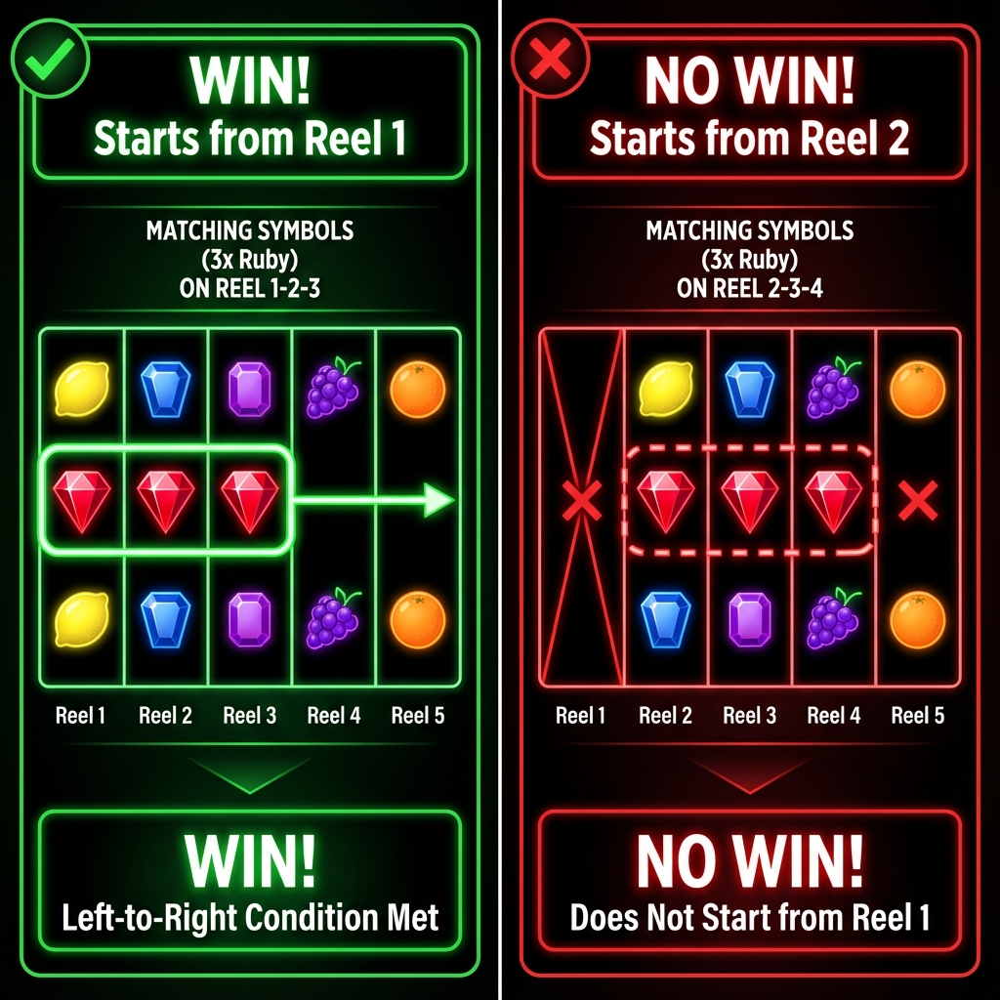
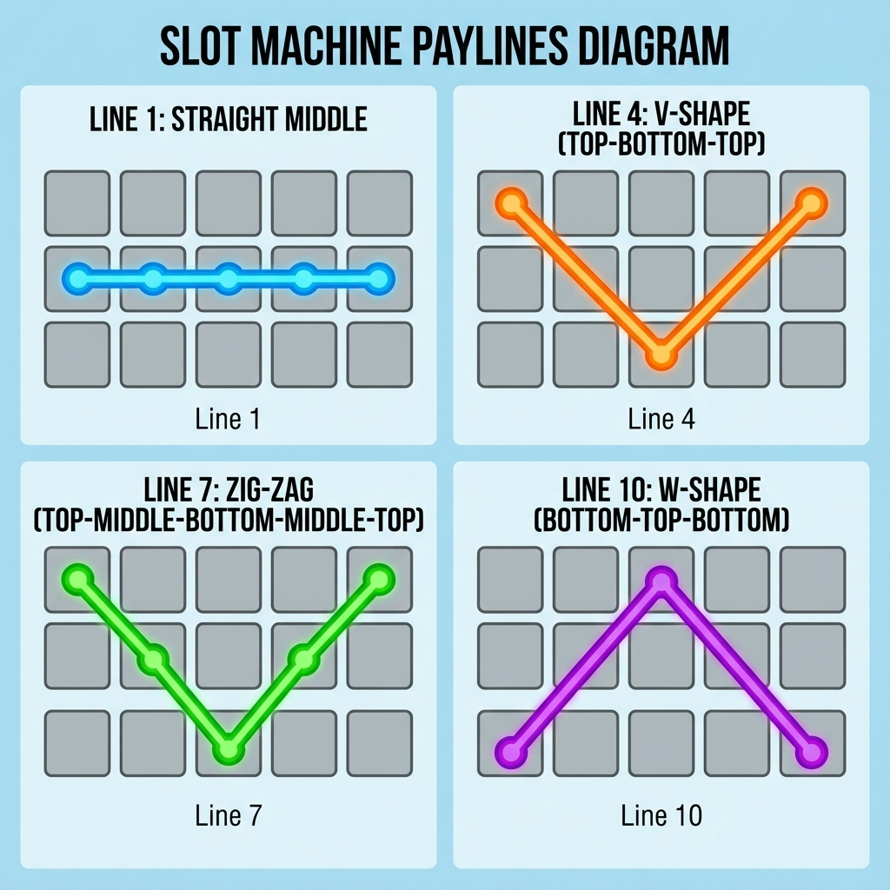
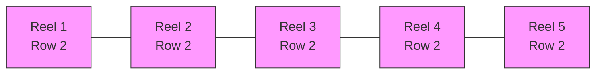
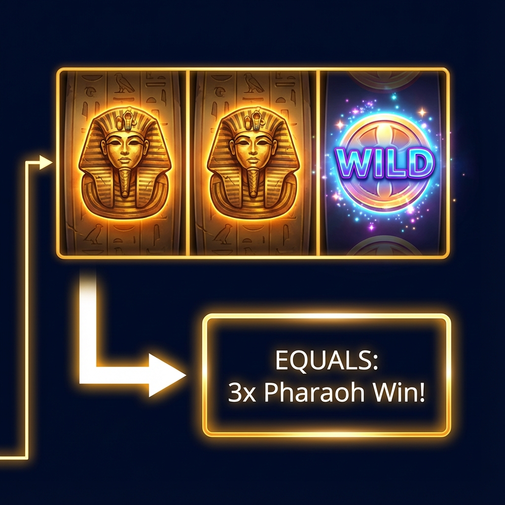
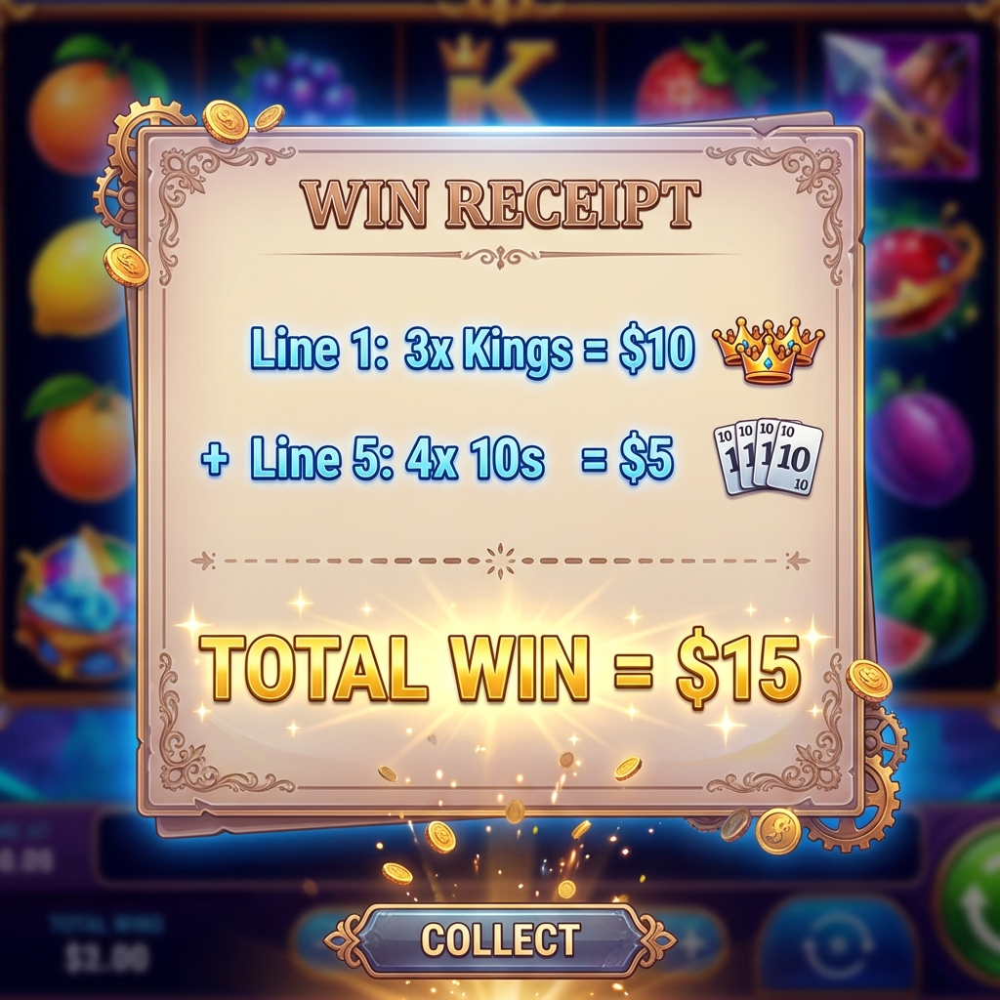

# Phân Tích Chuyên Sâu: Quy Tắc Thắng (Win Rules)

Tài liệu này giải thích chi tiết cơ chế trả thưởng (Payout) cho game slot **5 Reel x 3 Row** của bạn.

## 0. Cấu Trúc Bàn Chơi (The Grid)

Trước khi nói về thắng thua, hãy nhìn vào bản đồ của chúng ta. Game Slot tiêu chuẩn gồm **5 Cột (Reels)** và **3 Hàng (Rows)**.



*   **Reel 1 (Cột đầu tiên)**: Đây là cột quan trọng nhất. Mọi chiến thắng thông thường **PHẢI** bắt đầu từ đây.
*   **Rows**: Các hàng ngang để gióng dòng thắng.

## 1. Hệ Thống Biểu Tượng (Symbols)

Game của bạn có 10 hình (IDs: `00` đến `09`). Để game cân bằng và hấp dẫn, chúng ta chia chúng thành 4 nhóm quyền lực:

### A. Nhóm Đặc Biệt (Special)
Đây là những symbol quan trọng nhất để tạo nên sự kịch tính.

*   **WILD (ID: 08)**
    *   **Vai trò:** "Kẻ đóng thế hoàn hảo".
    *   **Quy tắc:** Nó có thể thay thế cho bất kỳ symbol nào (trừ Scatter) để tạo thành dòng thắng.
    *   *Ví dụ:* Bạn có `[Pharaoh] [Pharaoh] [WILD]`. Máy sẽ tính là `[Pharaoh] [Pharaoh] [Pharaoh]` => Bạn thắng lớn!

*   **SCATTER (ID: 09)**
    *   **Vai trò:** "Chìa khóa mở kho báu".
    *   **Quy tắc:** Không cần nằm trên dòng kẻ. Chỉ cần xuất hiện đủ số lượng (thường là 3) ở **bất kỳ đâu** trên màn hình là kích hoạt vòng quay miễn phí (Free Spins) hoặc Bonus Game.



### B. Nhóm Trả Thưởng (Paying Symbols)
Chia thành 2 hạng cân để tạo cảm giác "thắng nhỏ thường xuyên" và "thắng lớn hiếm hoi".

*   **Hạng Cao (High Value) - IDs: 05, 06, 07**
    *   Đại diện các vật phẩm quý (Vua, Quái vật rồng, Tượng vàng...).
    *   Ăn tiền nhiều, xuất hiện ít hơn.
    *   Chỉ cần 2 hoặc 3 hình là đã có thưởng.

*   **Hạng Thấp (Low Value) - IDs: 00, 01, 02, 03, 04**
    *   Đại diện các ký tự bài (10, J, Q, K, A) hoặc các item nhỏ.
    *   Xuất hiện nhiều, giúp người chơi cầm cự vốn.
    *   Thường cần 3 hình trở lên mới có thưởng.

---

## 2. Dòng Thắng (Paylines) - Ma Trận Lưới Thần

Slot 5x3 thường có **20 Dòng Thắng Tiêu Chuẩn**. Qúy tắc bất di bất dịch: **"Tính từ trái sang phải" (Left to Right)**. Dòng thắng phải bắt đầu từ cột đầu tiên (Reel 1).

Dưới đây là mô phỏng 9 dòng cơ bản nhất bạn nên có:




### Quy Tắc Bất Di Bất Dịch: "Từ Trái Sang Phải" (Left to Right)

Đây là quy tắc làm đau đầu nhiều người mới chơi nhất.
*   **Thắng:** [Hình] [Hình] [Hình] (Tại Reel 1, 2, 3)
*   **KHÔNG Thắng:** [Hình] [Hình] [Hình] (Tại Reel 2, 3, 4) -> Mặc dù có 3 hình giống nhau nhưng không dính vào cột 1 nên không tính.



### Các Kiểu Dòng Thắng (Payline Patterns)
Dưới đây là một số ví dụ về các đường kẻ ziczac phức tạp hơn:



### Dòng 1: Ngang Giữa (Dễ nhất)


### Dòng 2 & 3: Ngang Trên & Dưới
```mermaid
graph TD
    subgraph Dòng 2 (Row 1)
    A1[▇] --- A2[▇] --- A3[▇] --- A4[▇] --- A5[▇]
    end
    subgraph Dòng 3 (Row 3)
    B1[▄] --- B2[▄] --- B3[▄] --- B4[▄] --- B5[▄]
    end
```

### Dòng 4: Chữ V (V-Shape)
Đi từ đỉnh xuống đáy rồi lên lại.
`[0,0] -> [1,1] -> [2,2] -> [3,1] -> [4,0]`
(Tọa độ: Cột, Hàng)

### Dòng 5: Chữ V Ngược (Inverted V)
Đi từ đáy lên đỉnh rồi xuống lại.

---

## 3. Cách Tính Tiền (The Math)

Giả sử người chơi cược **$1** cho mỗi vòng quay.

**Ví dụ tình huống thắng:**
Màn hình xuất hiện kết quả sau trên Dòng 1 (Ngang Giữa):
`[Pharaoh] [Pharaoh] [WILD] [LowItem] [Pharaoh]`

1.  Máy quét từ Reel 1: Có **Pharaoh**.
2.  Reel 2: Có **Pharaoh** -> Kết nối! (Chuỗi 2).
3.  Reel 3: Có **WILD**. WILD thay thế cho Pharaoh -> Kết nối! (Chuỗi 3).
4.  Reel 4: Gặp **LowItem**. Khác loại Pharaoh -> **Đứt chuỗi!**
5.  **KẾT QUẢ:** Người chơi thắng **3 x Pharaoh**.



### Tổng Kết Tiền (Calculation)

Nếu bạn thắng nhiều dòng cùng lúc, máy sẽ cộng dồn lại thành **Total Win**.



**Tra bảng lương (Paytable):**
*   2 x Pharaoh = x5 (Hòa vốn)
*   **3 x Pharaoh = x50 (Thắng $50)**
*   4 x Pharaoh = x200 (Thắng lớn)
*   5 x Pharaoh = x1000 (Nổ hũ - Jackpot)

=> Vì chuỗi dừng ở 3, người chơi nhận **$50**.

---

## 4. Bảng Trả Thưởng Đề Xuất (Paytable Matrix)

Đây là bảng cấu hình "chuẩn cơm mẹ nấu" cho 10 symbols của bạn:

| Symbol ID | Tên (Gợi nhớ) | 3 Hình | 4 Hình | 5 Hình | Ghi chú |
| :--- | :--- | :--- | :--- | :--- | :--- |
| **00** | 10 | x5 | x15 | x50 | Tần suất ra nhiều nhất |
| **01** | J | x5 | x15 | x50 | |
| **02** | Q | x10 | x25 | x100 | |
| **03** | K | x10 | x30 | x150 | |
| **04** | A | x15 | x50 | x200 | |
| **05** | Item Đồng | x20 | x80 | x300 | |
| **06** | Item Bạc | x30 | x100 | x500 | |
| **07** | **Item Vàng** | **x50** | **x200** | **x1000** | Symbol đắt giá nhất |
| **08** | **WILD** | - | - | - | Thay thế tất cả (trừ 09) |
| **09** | **SCATTER** | - | - | - | 3 hình = Free Spins |

---

## 5. Tổng Kết Logic Code

Khi bạn bấm nút Spin, thuật toán sẽ chạy theo trình tự sau:
1.  **Generate**: Máy sinh ngẫu nhiên ma trận 5 cột x 3 hàng (Backend hoặc Frontend Logic).
2.  **Mapping**: Ánh xạ ID từ `00` đến `09` vào ma trận.
3.  **Check Win**:
    *   Duyệt qua từng dòng trong **20 Dòng Kẻ (Paylines)**.
    *   Tại mỗi dòng, đếm số lượng symbol liên tiếp giống nhau (tính cả WILD).
    *   Tra bảng Paytable -> Ra số tiền thắng của dòng đó.
    *   Cộng tổng tiền thắng của tất cả các dòng.
4.  **Display**:
    *   Reel dừng lại.
    *   Vẽ đườngline nối các hình chiến thắng (Line Connector).
    *   Hiệu ứng nổ tiền (Coin Shower).

Bạn có đồng ý với logic và bảng trả thưởng này không? Nếu OK, tôi sẽ bắt tay vào code file `SlotRuleManager.ts` ngay!
